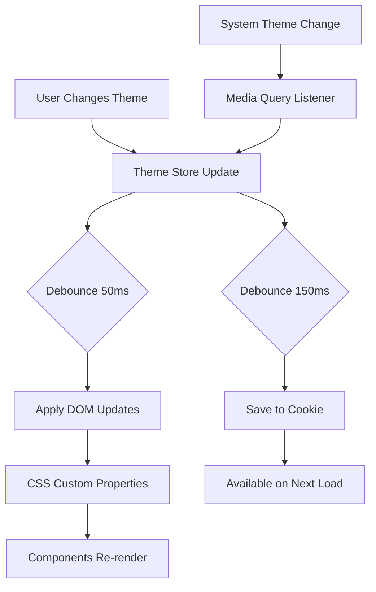

# Theme System Architecture

## Overview

The rwsdk demo implements a comprehensive theming system built on Trailhead UI components with advanced features including:

- **Runtime theme switching** with instant visual feedback
- **SSR-safe initialization** preventing flash of unstyled content (FOUC)
- **Cookie-based persistence** for cross-session theme retention
- **WCAG-compliant color contrast** with automatic foreground/background pairing
- **Semantic color tokens** for consistent theming across all components
- **Performance optimized** with debouncing and minimal DOM updates

## Architecture Components

### 1. Theme Store (`/src/app/components/theme/store.ts`)

Central state management using Zustand with cookie persistence.

**Key Features:**

- Manages theme state (mode, primary, secondary, destructive, base, layout colors)
- Automatic DOM updates via CSS custom properties
- Debounced updates: 50ms for DOM, 150ms for cookies
- System theme detection and reactive updates
- Validation for all color inputs

**State Shape:**

```typescript
interface ThemeState {
  mode: 'light' | 'dark' | 'system'
  primary: ColorName // User's accent color
  secondary: ColorName // Muted/neutral tones
  destructive: ColorName // Error/danger states
  base: ColorName // Gray tone palette for content
  layout: ColorName // Gray tone for layout components
}
```

**Layout vs Base Colors:**

- `base`: Defines general UI foundation colors (content areas, cards, inputs)
- `layout`: Specifically themes structural/navigational components (Sidebar, StackedLayout, AuthLayout)
- This separation enables distinct visual hierarchy between content and navigation

### 2. Color Contrast System (`/src/app/components/theme/constants.ts`)

Ensures WCAG AA compliance by mapping colors to appropriate shade/foreground combinations.

**COLOR_CONTRAST_MAP:**

- Light colors (amber, yellow, lime, cyan) → Dark foreground text
- Dark colors (blue, emerald, etc.) → White foreground text
- Each color specifies optimal shade (300-600) for background use

Example:

```typescript
amber: { shade: '400', foreground: 'var(--color-amber-950)' }
blue: { shade: '600', foreground: 'white' }
```

### 3. CSS Architecture (`/src/app/styles.css`)

**Theme-Switchable Colors:**

- Full shade scales (50-950) for primary, secondary, destructive, base, layout
- Applied dynamically via CSS custom properties

**Semantic Color Pairs:**

- Static semantic colors with predefined foreground values
- `--color-success` / `--color-success-foreground`
- `--color-warning` / `--color-warning-foreground`
- `--color-info` / `--color-info-foreground`

### 4. SSR Implementation

**Multi-Layer Initialization:**

1. **Server**: Cookies parsed, theme classes applied to `<html>`
2. **theme-init.js**: Synchronous script prevents FOUC
3. **React Hydration**: Store hydrates from cookies, enables transitions

**Resource Hints in Document.tsx:**

```typescript
<link rel="preload" href="/theme-init.js" as="script" />
<script src="/theme-init.js" />
```

### 5. Component Integration

All Catalyst UI components support semantic color variants:

```typescript
// Semantic variants (theme-aware)
<Button color="primary" />     // Uses var(--color-primary)
<Badge color="destructive" />  // Uses var(--color-destructive)

// Specific variants (static colors)
<Switch color="emerald" />     // Always emerald regardless of theme

// Layout components use layout color
<Sidebar />         // Uses var(--color-layout-*)
<StackedLayout />   // Uses var(--color-layout-*)
<AuthLayout />      // Uses var(--color-layout-*)
```

### 6. Preset Theme System (`/src/app/components/theme/preset-theme.tsx`)

Provides a lightweight theme setup without runtime state management for maximum performance.

**Features:**

- Zero JavaScript overhead for theming
- Static CSS custom properties
- SSR-friendly with no hydration issues
- ~15KB smaller bundle size
- Still supports system dark mode preference

**Configuration:**

```typescript
export const PRESET_THEME: ThemeState = {
  mode: 'light',
  primary: 'purple',
  secondary: 'slate',
  destructive: 'red',
  base: 'gray',
  layout: 'gray',
}
```

### 7. Theme Export Utility (`/src/app/components/theme/utils/export-theme.ts`)

Allows users to export their current theme configuration as static CSS for preset theme setups.

**Features:**

- Generates complete CSS with @theme block
- Includes all color shades with OKLCH values
- Proper contrast mapping for foreground colors
- Clipboard integration for easy copying
- Available through the theme dialog UI

**Generated CSS Structure:**

```css
@import 'tailwindcss';

@theme {
  /* Color definitions using oklch for perceptual uniformity */
  --color-primary-50: oklch(...);
  /* ... all shades ... */

  /* Semantic color pairs for proper contrast */
  --color-primary: var(--color-primary-600);
  --color-primary-foreground: white;
}
```

## Data Flow



## Performance Optimizations

### Debouncing Strategy

- **DOM Updates**: 50ms - Quick visual feedback
- **Cookie Writes**: 150ms - Prevents excessive I/O
- **Implementation**: Custom debounce utility with proper cleanup

### CSS Custom Properties

- No JavaScript style manipulation on individual elements
- Single DOM update applies theme globally
- Hardware-accelerated CSS transitions

### Memoization

- Color contrast lookups cached in constants
- Theme state equality checks prevent redundant updates
- React components use CSS classes, not inline styles

## Theme Switching Modes

### Dynamic Theme (Default)

Full runtime theme switching with state management:

- User can change colors in real-time
- Preferences persist across sessions
- Smooth transitions between themes
- Full theme dialog with all options

### Preset Theme (Performance)

Static theme configuration for maximum performance:

- No JavaScript for theming
- Defined entirely in CSS
- No state management overhead
- Ideal for apps with predetermined brand colors

**When to use each:**

- **Dynamic**: User personalization, multi-brand support, A/B testing
- **Preset**: Single brand, performance critical, simplicity valued

## Testing Architecture

### Test Coverage (50 tests)

1. **Cookie Persistence** - Encoding, parsing, validation
2. **Theme Store** - State management, DOM updates, system theme
3. **Debouncing** - Timer management, cleanup, cancellation
4. **Integration** - Full theme switching flow, SSR simulation

### Key Test Patterns

```typescript
// Mock system theme preference
vi.mocked(global.matchMedia).mockReturnValue({
  matches: true, // dark mode
  media: '(prefers-color-scheme: dark)',
})

// Test cookie persistence
setThemeCookie(theme)
const retrieved = parseThemeCookie(getThemeCookie())
expect(retrieved).toEqual(theme)
```

## Security Considerations

### Cookie Security

- HttpOnly not used (needs client-side access)
- SameSite=Strict prevents CSRF
- No sensitive data stored
- Validates all parsed values

### Input Validation

- Color names validated against whitelist
- Invalid values rejected with console warnings
- Graceful fallbacks for missing configurations

## Browser Compatibility

### Supported Features

- CSS Custom Properties (all modern browsers)
- matchMedia API for system theme detection
- requestAnimationFrame for smooth updates
- Cookie API for persistence

### Fallbacks

- Default theme for browsers without cookie support
- Light mode default for missing system theme API
- Inline critical styles prevent completely unstyled content

## Future Enhancements

### Potential Improvements

1. **Theme Presets** - Save custom theme combinations
2. **Contrast Modes** - High contrast accessibility option
3. **Animation Preferences** - Respect prefers-reduced-motion
4. **Theme Scheduling** - Auto-switch based on time of day
5. ~~**Export/Import**~~ - ✅ Implemented: Export theme as CSS via dialog

### API Considerations

```typescript
// Potential theme preset API
interface ThemePreset {
  name: string
  theme: ThemeState
  isDefault?: boolean
}

// Potential contrast mode API
interface ContrastMode {
  mode: 'normal' | 'high' | 'highest'
  borderWidth: number
  shadowIntensity: number
}
```

## Component Guidelines

### Adding New Components

1. Use semantic color tokens for variants
2. Include foreground colors for text/icons
3. Support all semantic variants (primary, secondary, destructive)
4. Test with all 21 color themes
5. Ensure WCAG AA contrast ratios

### Example Component Pattern

```typescript
const colors = {
  // Semantic variants
  primary: 'bg-[var(--color-primary)] text-primary-foreground',
  secondary: 'bg-[var(--color-secondary)] text-secondary-foreground',
  destructive: 'bg-[var(--color-destructive)] text-destructive-foreground',

  // Specific color variants
  emerald: 'bg-emerald-600 text-white',
  amber: 'bg-amber-400 text-amber-950',
}

// Layout components use layout color scale
const layoutColors = {
  background: 'bg-layout-50 dark:bg-layout-950',
  border: 'border-layout-200 dark:border-layout-800',
  text: 'text-layout-900 dark:text-layout-100',
}
```

## Debugging Guide

### Common Issues

1. **Theme Flash on Load**
   - Check theme-init.js is loading synchronously
   - Verify cookie parsing in server-side code
   - Ensure no render-blocking resources above theme script

2. **Colors Not Updating**
   - Verify CSS custom properties in DevTools
   - Check for hardcoded colors in components
   - Ensure theme store subscription is active

3. **Contrast Issues**
   - Verify COLOR_CONTRAST_MAP has entry for color
   - Check foreground color is applied to text/icons
   - Test with accessibility tools

### Debug Commands

```bash
# Run theme tests
pnpm test theme

# Check for hardcoded colors
grep -r "text-white\|text-black" src/app/components

# Verify CSS variables
grep -r "var(--color-" src/app/styles.css
```

## Conclusion

The theme system provides a robust, performant, and accessible theming solution that seamlessly integrates with RedwoodJS SDK and Catalyst UI components. Its architecture prioritizes user experience with instant feedback, persistent preferences, and guaranteed readability across all theme combinations.
