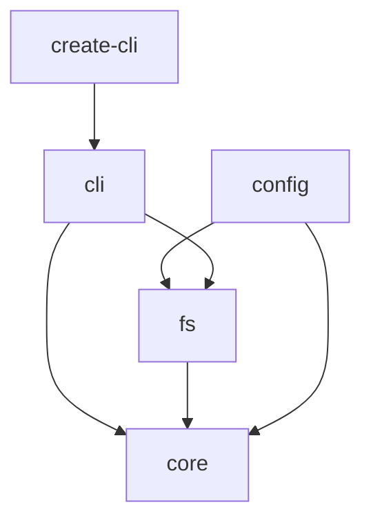
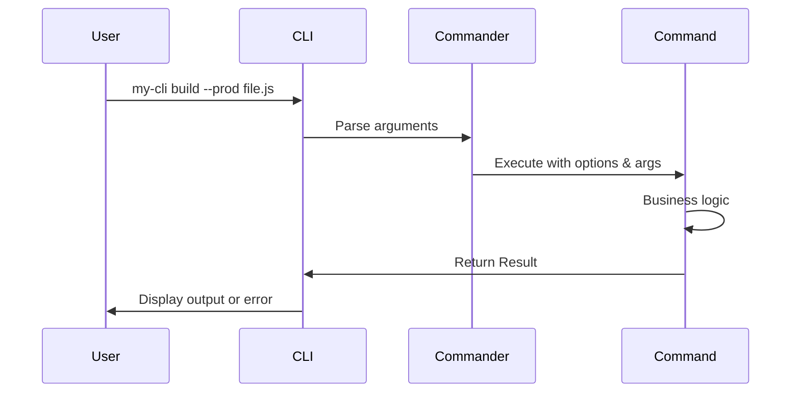

# Architecture Overview

Understanding the design decisions and architecture of the Trailhead CLI framework.

## Core Philosophy

The Trailhead framework is built on three fundamental principles:

1. **Explicit Error Handling**: No hidden exceptions - all errors are values
2. **Functional Programming**: Pure functions, immutability, and composition
3. **Type Safety**: Full TypeScript support with inference

These principles drive every architectural decision in the framework.

## Why Result Types?

Traditional JavaScript/TypeScript code relies on exceptions for error handling:

```typescript
// Traditional approach - errors are hidden
function readConfig(path: string): Config {
  const content = fs.readFileSync(path, 'utf8')  // Might throw!
  return JSON.parse(content)                     // Might throw!
}

// Calling code must remember to catch
try {
  const config = readConfig('config.json')
} catch (error) {
  // Handle error
}
```

This approach has several problems:
- Errors are invisible in the type system
- Easy to forget error handling
- Difficult to test error paths
- Stack traces can be lost

### The Result Type Solution

Trailhead uses Result types to make errors explicit:

```typescript
// Trailhead approach - errors are values
async function readConfig(path: string): Promise<Result<Config, Error>> {
  const readResult = await readFile(path)
  if (readResult.isError()) {
    return readResult  // Propagate error
  }
  
  try {
    const config = JSON.parse(readResult.value)
    return ok(config)
  } catch (error) {
    return err(new Error(`Invalid JSON: ${error.message}`))
  }
}

// Calling code - error handling is required
const result = await readConfig('config.json')
if (result.isError()) {
  // TypeScript knows result.error exists here
  logger.error(result.error.message)
} else {
  // TypeScript knows result.value exists here
  useConfig(result.value)
}
```

Benefits:
- **Type Safety**: TypeScript ensures you handle errors
- **Explicit Flow**: Error paths are visible
- **Composable**: Chain operations with `map` and `flatMap`
- **Testable**: Easy to test both success and error cases

## Package Architecture

The framework is organized as a monorepo with clear separation of concerns:

```
@esteban-url/
├── core           # Fundamental types (Result, Option)
├── cli            # CLI framework and command system
├── fs             # File system operations
├── config         # Configuration management
└── create-cli     # Project generator
```

### Why Monorepo?

1. **Coordinated Releases**: All packages version together
2. **Shared Development**: Common tooling and testing
3. **Better DX**: Single repo to clone and contribute
4. **Type Safety**: Cross-package types stay in sync

### Package Relationships



Each package has a single responsibility:
- **core**: Provides Result type and utilities
- **fs**: Wraps Node.js fs with Result types
- **cli**: Command creation and execution
- **config**: Type-safe configuration loading
- **create-cli**: Scaffolds new projects

## Command Architecture

Commands are the building blocks of CLI applications. The framework uses Commander.js for command parsing and registration:

```typescript
// Command definition
const command = createCommand<MyOptions>({
  name: string
  description?: string
  arguments?: string        // e.g., '<file>' or '[dir]'
  options?: Array<{         // Command flags/options
    flags: string
    description: string
    type?: 'boolean' | 'string' | 'number'
  }>
  action: (options: MyOptions, context: CommandContext) => Promise<Result<any, Error>>
})

// CLI registration with Commander
const cli = createCLI({ name: 'my-cli', version: '1.0.0' })

cli.command(command.name)
  .description(command.description)
  .arguments(command.arguments || '')
  .action(async (...args) => {
    const result = await command.execute(options, context)
    if (result.isErr()) process.exit(1)
  })
```

### Command Execution Flow

1. **Commander Parsing**: User input → parsed options and args
2. **Command Execution**: Call command.execute with options and context
3. **Business Logic**: Command action runs with Result-based error handling
4. **Output Handling**: Display results or errors



### Why Functional Commands?

Commands follow functional programming principles:
- Take typed options and context
- Receive immutable context with logger and args
- Return Result values for explicit error handling
- Perform side effects only through provided abstractions (fs, logger)

This makes commands:
- **Testable**: Inject test context with mock logger
- **Type-safe**: Full TypeScript inference for options
- **Predictable**: Explicit error handling with Results
- **Composable**: Chain operations with Result methods

## File System Design

The `@esteban-url/fs` package wraps Node.js fs operations:

### Async by Default

All operations are async-first:

```typescript
// Always async
const result = await readFile('data.txt')

// Sync available but discouraged
const result = readFileSync('data.txt')
```

Why? Async operations:
- Don't block the event loop
- Allow progress reporting
- Enable cancellation
- Scale better

### Consistent API

Every operation follows the same pattern:

```typescript
function operation(...args): Promise<Result<T, Error>>
```

This consistency means:
- Learn once, use everywhere
- Predictable error handling
- Easy to compose operations

## Testing Architecture

Testing is a first-class concern with dedicated utilities:

### Test Utilities

```typescript
// Create test context with mock logger
const context = createTestContext()
const result = await myCommand.execute(options, context)

// Access captured logs
console.log(context.logs)     // Logged messages
console.log(context.errors)   // Error messages

// Test with virtual file system
const context = await createTestContextWithFiles({
  'data/test.json': JSON.stringify({ test: true }),
  'config.yml': 'apiUrl: http://localhost'
})

// Files are created in a temp directory
console.log(context.cwd)  // e.g., /tmp/test-xyz/
```

### Why Built-in Testing?

1. **Consistency**: Everyone tests the same way
2. **Best Practices**: Proper mocking built-in
3. **Type Safety**: Mocks match real interfaces
4. **Speed**: In-memory operations

## Configuration Strategy

Configuration uses a builder pattern with multiple sources:

```typescript
import { createConfigManager, defineSchema } from '@esteban-url/config'
import { string, number, boolean } from '@esteban-url/config'

// Define schema with builders
const schema = defineSchema({
  port: number().min(1).max(65535).default(3000),
  apiUrl: string().url().required(),
  debug: boolean().default(false)
})

// Create manager with sources
const configManager = createConfigManager({
  schema,
  sources: [
    { type: 'file', path: './config.json' },
    { type: 'env', prefix: 'APP_' },
    { type: 'cli' }
  ]
})

const result = await configManager.load()
```

### Benefits

1. **Type Inference**: Config type from schema
2. **Multiple Sources**: Files, env vars, CLI args
3. **Validation**: Runtime type checking
4. **Watch Support**: React to config changes
5. **Priority System**: CLI > ENV > File

## Error Handling Patterns

The framework encourages specific error handling patterns:

### Early Return

```typescript
async function process(path: string) {
  const readResult = await readFile(path)
  if (readResult.isError()) {
    return readResult  // Early return
  }
  
  // Continue with readResult.value
}
```

### Error Transformation

```typescript
const result = await readFile(path)
  .map(content => JSON.parse(content))
  .mapError(error => new Error(`Config error: ${error.message}`))
```

### Error Recovery

```typescript
const config = await loadConfig('app.json')
  .unwrapOr(defaultConfig)  // Use default on error
```

## Performance Considerations

### Lazy Loading

Commands can be loaded on demand:

```typescript
const commands = [
  {
    name: 'heavy',
    load: () => import('./commands/heavy.js')
  }
]
```

### Streaming

For large files, use streams:

```typescript
const stream = createReadStream('large.csv')
for await (const chunk of stream) {
  // Process chunk
}
```

### Parallel Operations

Result types work with Promise.all:

```typescript
const results = await Promise.all([
  readFile('a.txt'),
  readFile('b.txt'),
  readFile('c.txt'),
])

const errors = results.filter(r => r.isError())
const values = results.filter(r => r.isOk())
```

## Security Considerations

### Path Traversal Protection

Always use absolute paths:

```typescript
const safePath = resolve(baseDir, userInput)
if (!safePath.startsWith(baseDir)) {
  return err(new Error('Invalid path'))
}
```

### Input Validation

Zod schemas validate all user input:

```typescript
const schema = z.object({
  file: z.string().regex(/^[\w-]+\.json$/),
  mode: z.enum(['read', 'write']),
})
```

### Secret Handling

Never log sensitive data:

```typescript
logger.info('Connecting to database...')  // Don't log connection string
```

## Future Considerations

The architecture is designed to support:

1. **Plugin System**: Dynamic command loading
2. **Middleware**: Command preprocessing
3. **Hooks**: Lifecycle events
4. **Observability**: Tracing and metrics

All without breaking existing code.

## Summary

The Trailhead architecture prioritizes:

- **Developer Experience**: Predictable, type-safe APIs
- **Reliability**: Explicit error handling everywhere
- **Performance**: Async-first, lazy loading
- **Testing**: First-class testing support
- **Security**: Safe defaults and validation

These architectural decisions create a framework that's both powerful and pleasant to use.